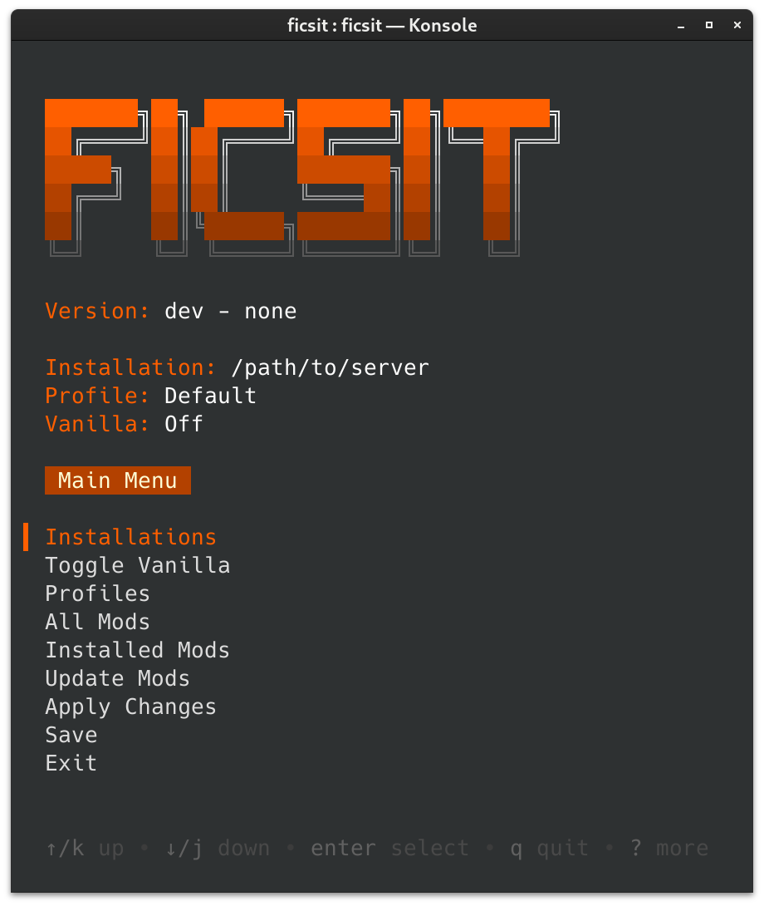

<!-- markdownlint-disable MD033 -->
<!-- markdownlint-disable MD041 -->


# ficsit-cli [](https://github.com/Vilsol/ficsit-cli/actions/workflows/push.yaml)   [](https://github.com/Vilsol/ficsit-cli/blob/master/LICENSE) 

A CLI tool for managing mods for the game [Satisfactory](https://www.satisfactorygame.com/).

---

## Installation

<table>
  <tr>
    <th></th>
    <th>amd64</th>
    <th>386</th>
    <th>arm64</th>
    <th>armv7</th>
    <th>ppc64le</th>
  </tr>
  <tr>
    <th>Windows</th>
    <td><a href="https://github.com/Vilsol/ficsit-cli/releases/latest/download/ficsit_windows_amd64.exe">amd64</a></td>
    <td><a href="https://github.com/Vilsol/ficsit-cli/releases/latest/download/ficsit_windows_386.exe">386</a></td>
    <td><a href="https://github.com/Vilsol/ficsit-cli/releases/latest/download/ficsit_windows_arm64.exe">arm64</a></td>
    <td><a href="https://github.com/Vilsol/ficsit-cli/releases/latest/download/ficsit_windows_armv7.exe">armv7</a></td>
    <td>N/A</td>
  </tr>
  <tr>
    <th>Arch</th>
    <td colspan="5" style="text-align: center"><a href="https://aur.archlinux.org/packages/ficsit-cli-bin"><code>yay -S ficsit-cli-bin</code></a></td>
  </tr>
  <tr>
    <th>Debian</th>
    <td><a href="https://github.com/Vilsol/ficsit-cli/releases/latest/download/ficsit_linux_amd64.deb">amd64</a></td>
    <td><a href="https://github.com/Vilsol/ficsit-cli/releases/latest/download/ficsit_linux_386.deb">386</a></td>
    <td><a href="https://github.com/Vilsol/ficsit-cli/releases/latest/download/ficsit_linux_arm64.deb">arm64</a></td>
    <td><a href="https://github.com/Vilsol/ficsit-cli/releases/latest/download/ficsit_linux_armv7.deb">armv7</a></td>
    <td><a href="https://github.com/Vilsol/ficsit-cli/releases/latest/download/ficsit_linux_ppc64le.deb">ppc64le</a></td>
  </tr>
  <tr>
    <th>Fedora</th>
    <td><a href="https://github.com/Vilsol/ficsit-cli/releases/latest/download/ficsit_linux_amd64.rpm">amd64</a></td>
    <td><a href="https://github.com/Vilsol/ficsit-cli/releases/latest/download/ficsit_linux_386.rpm">386</a></td>
    <td><a href="https://github.com/Vilsol/ficsit-cli/releases/latest/download/ficsit_linux_arm64.rpm">arm64</a></td>
    <td><a href="https://github.com/Vilsol/ficsit-cli/releases/latest/download/ficsit_linux_armv7.rpm">armv7</a></td>
    <td><a href="https://github.com/Vilsol/ficsit-cli/releases/latest/download/ficsit_linux_ppc64le.rpm">ppc64le</a></td>
  </tr>
  <tr>
    <th>Alpine</th>
    <td><a href="https://github.com/Vilsol/ficsit-cli/releases/latest/download/ficsit_linux_amd64.apk">amd64</a></td>
    <td><a href="https://github.com/Vilsol/ficsit-cli/releases/latest/download/ficsit_linux_386.apk">386</a></td>
    <td><a href="https://github.com/Vilsol/ficsit-cli/releases/latest/download/ficsit_linux_arm64.apk">arm64</a></td>
    <td><a href="https://github.com/Vilsol/ficsit-cli/releases/latest/download/ficsit_linux_armv7.apk">armv7</a></td>
    <td><a href="https://github.com/Vilsol/ficsit-cli/releases/latest/download/ficsit_linux_ppc64le.apk">ppc64le</a></td>
  </tr>
  <tr>
    <th>Linux</th>
    <td><a href="https://github.com/Vilsol/ficsit-cli/releases/latest/download/ficsit_linux_amd64">amd64</a></td>
    <td><a href="https://github.com/Vilsol/ficsit-cli/releases/latest/download/ficsit_linux_386">386</a></td>
    <td><a href="https://github.com/Vilsol/ficsit-cli/releases/latest/download/ficsit_linux_arm64">arm64</a></td>
    <td><a href="https://github.com/Vilsol/ficsit-cli/releases/latest/download/ficsit_linux_armv7">armv7</a></td>
    <td><a href="https://github.com/Vilsol/ficsit-cli/releases/latest/download/ficsit_linux_ppc64le">ppc64le</a></td>
  </tr>
  <tr>
    <th>macOS</th>
    <td colspan="4" style="text-align: center"><a href="https://github.com/Vilsol/ficsit-cli/releases/latest/download/ficsit_darwin_all">darwin_all</a></td>
    <td>N/A</td>
  </tr>
</table>

## Usage

### Interactive CLI

To launch the interactive CLI, run the executable without any arguments.

All screens display control hints at the bottom.

### Command Line

Run `ficsit help` to see a list of available commands and flags.

## Managing Installations

Unlike [Satisfactory Mod Manager](https://github.com/satisfactorymodding/SatisfactoryModManager/),
ficsit-cli does not automatically detect installations.

First, locate your game install path.
Check the [Modding FAQ](https://docs.ficsit.app/satisfactory-modding/latest/faq.html#Files_GameInstall)
to learn how to find it given your specific install situation.

To add installations in the interactive CLI, use `Installations` > `new installation`.

To add installations from the command line, use `ficsit-cli installation add yourPathHere`.

## Troubleshooting

* Profile and installation records are located in `%APPDATA%\ficsit\`
* Downloads are cached in `%LOCALAPPDATA%\ficsit\downloadCache\`

Get help on the [modding Discord](https://discord.ficsit.app/).

## Development

### Dependencies

* [Go 1.21](https://go.dev/doc/install)
* IDE of Choice. Goland or VSCode suggested.

### Code Generation

If you update any of the GraphQL queries, run this to update generated code:

```bash
(echo "y") | npx graphqurl https://api.ficsit.app/v2/query --introspect -H 'content-type: application/json' > schema.graphql
go generate -tags tools -x ./...
```

If this command fails due to a mismatched schema,
you may need to use the url `https://api.ficsit.dev/v2/query` instead.

## Building

```bash
go build
```

Will produce `ficsit-cli.exe` in the repo root directory.

### Linting

Install `golangci-lint` via the directions [here](https://golangci-lint.run/usage/install/#local-installation),
but make sure to install the version specified in `.github/workflows/push.yaml` instead of whatever it suggests.

Then, to run it, use:

```bash
golangci-lint run --fix
```

### Updating generated docs

The files within `./docs` are generated using cobra, use the following to update
them.

```bash
go run tools.go
```
